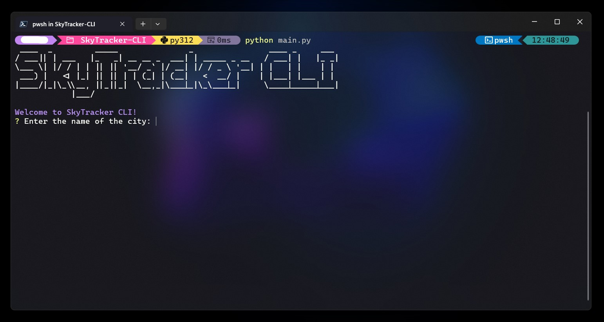

# SkyTracker CLI

Welcome to **SkyTracker CLI**! This command-line weather app, built in Python, provides fast, accurate weather information right from your terminal. Designed to be efficient and straightforward, SkyTracker CLI brings essential weather insights to users in a simple and accessible format.

---

## Features

### 🌍 Location-Based Weather Retrieval
SkyTracker CLI starts by prompting the user for a city name. With the help of the **geopy** library and Nominatim, it retrieves the city’s latitude and longitude coordinates. This allows precise location-based weather data for any city around the globe.

### 🌦️ Real-Time Weather Data
Using the OpenMeteo API, SkyTracker CLI fetches real-time weather information, including temperature, precipitation, and wind speed. This ensures that you always have up-to-date weather data on hand.

### 🕒 Local Time Calculation
SkyTracker CLI calculates and displays the city’s local time based on its time zone, thanks to the **TimezoneFinder** and **pytz** libraries. This feature helps users keep track of the local time for accurate weather context.

### 📆 Hourly Forecast
The app provides an option to view a detailed hourly forecast for the next several hours. By selecting ‘Yes,’ users can see a table of hourly temperature data, adjusted to the city’s local time, for easy reference throughout the day.

### ⚠️ User-Friendly Error Handling
In cases where a location cannot be found or specific weather data is unavailable, SkyTracker CLI displays clear and helpful error messages. This keeps users informed and prevents any guesswork.

---
